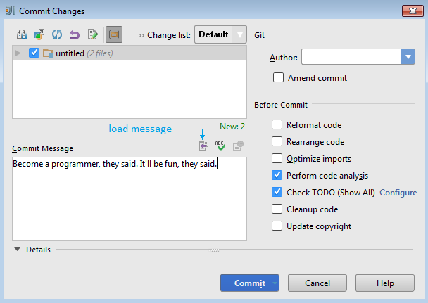

# What The Commit - Plugin for IntelliJ IDEA

Adds a button to the commit dialog (right above the commit message field), that loads a random commit message from [whatthecommit.com](http://www.whatthecommit.com).

Please rate this plugin in the [Plugin Repository](http://plugins.jetbrains.com/plugin/7536)

## Installation
Install this plugin via the plugin manager in IntelliJ (File &rarr; Settings &rarr; Plugins &rarr; Browse repositories &rarr; What The Commit).

## Usage

Just push the button ;-)

## License

Copyright 2014 Darek Kay <darekkay@eclectide.com>  

This project and its contents are open source under the [MIT license](LICENSE.txt).